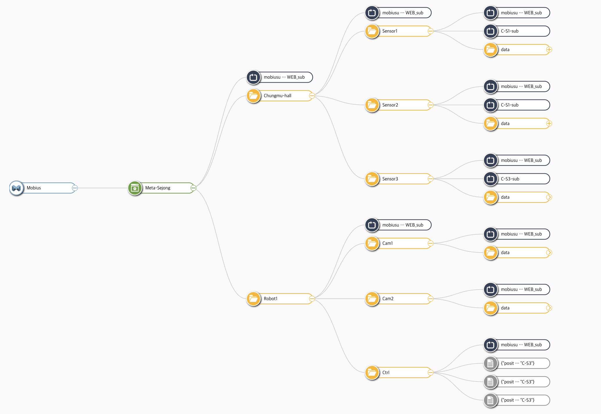

# KETI_Mobius_Contest
## 01. Installation Guide
**This Guide is based on macOS**
시작에 앞서 IoTKETI의 Mobius repository clone
```
% git clone https://github.com/IoTKETI/Mobius
```

IoTKETI의 mobius-open-platform repository clone
```
% git clone https://github.com/IoTKETI/mobius-open-platform
```

## 1-1. Mobius Server
### 1. MySQL Server
만약 이미 MySQL 서버가 설치 되어있다면 **반드시** 업그레이드 혹은 다운그레이드 해야 함. 만약 사용 중인 데이터베이스 존재 시 백업 완료 후 재설치 진행.
```
% mysql --version
mysql  Ver 8.4.6 for macos15.4 on arm64 (Homebrew)
```

mysql Ver 8.4 설치.
```
% brew install mysql@8.4
```

디렉터리 존재 및 소유권 확인.
```
% sudo mkdir -p /opt/homebrew/var/mysql
% sudo chown -R "$(whoami)":staff /opt/homebrew/var/mysql
```

MySQL 초기화.
```
% /opt/homebrew/opt/mysql@8.4/bin/mysqld --initialize-insecure \
  --user="$(whoami)" \
  --basedir="/opt/homebrew/opt/mysql@8.4" \
  --datadir="/opt/homebrew/var/mysql"
```

> 데이터 디렉터리에 이미 파일에 있다는 오류 발생 시 아래 명령 수행. (이전에 MySQL 설치가 되어 있었다면 발생 가능)
> 서버 완전 중지 및 잔재 데이터 제거
> ```
> % pkill -f mysqld || true
> % rm -f /opt/homebrew/var/mysql/mysql.sock /opt/homebrew/var/mysql/*.pid
> ```
> 
> 새 디렉터리 생성 및 권한 부여
> ```
> % sudo mkdir -p /opt/homebrew/var/mysql
> % sudo chown -R "$(whoami)":staff /opt/homebrew/var/mysql
> ```

필요 시 아래 명령 수행. PATH에 MySQL 8.4 바이너리 추가.
```
% echo 'export PATH="/opt/homebrew/opt/mysql@8.4/bin:$PATH"' >> ~/.zshrc
```

클라이언트 기본 소켓 경로 설정.
```
 % cat >> ~/.my.cnf <<'EOF'
[client]
socket=/opt/homebrew/var/mysql/mysql.sock
EOF
% chmod 600 ~/.my.cnf
```

설정 이후 shell 재시작 필수.
```
exec $SHELL -l
```

MySQL 서버 기동.
```
% brew services start mysql@8.4 
```

보안 설정 진행.
```
 % mysql_secure_installation
```

`root` 계정을 `mysql_native_password` 로 전환. MySQL 설정에서 해당 플러그인이 활성화 상태여야 함. 설정 파일에 접근.
```
nano /opt/homebrew/etc/my.cnf
```

해당 파일에 `mysql_native_password=ON` 존재하지 않을 시 `[mysqld]` 섹션 하단에 추가 이후 `Ctrl+O` > `Enter` > `Ctrl+X`.

설정 이후 MySQL 서버 재시작.
```
% brew services restart mysql@8.4
```

`root` plugin을 `mysql_native_password` 로 변경.
```
mysql -u root -p -e "ALTER USER 'root'@'localhost' IDENTIFIED WITH mysql_native_password BY 'rr000628'; FLUSH PRIVILEGES;"
```

`mobiusdb`DB 생성.
```
% mysql -u root -p -e "CREATE DATABASE IF NOT EXISTS mobiusdb CHARACTER SET utf8mb4 COLLATE utf8mb4_0900_ai_ci;"
```

Mobius repository에서 다운로드 한 파일 중 `/mobius/mobiusdb.sql` 스키마 import.
```
% mysql -u root -p mobiusdb < "Mobius repository clone 경로/Mobius-master/mobius/mobiusdb.sql"
```

### 2. Mosquitto MQTT
mosquitto 설치.
```
% brew install mosquitto
```

mosquitto 실행.
```
% brew services start mosquitto
```

mosquitto MQTT broker 실행.
```
% mosquitto -v
```

### 3. Node.js
Node.js 공식 [website](https://nodejs.org/en/download)에 접속하여 다운로드 진행. website 접속 후 LTS 버전 선택, using `nvm`, with `npm` 선택 후 아래 안내되는 명령 수행.
```
// 예시
// Download and install nvm:
% curl -o- https://raw.githubusercontent.com/nvm-sh/nvm/v0.40.3/install.sh | bash

// in lieu of restarting the shell
% \. "$HOME/.nvm/nvm.sh"

// Download and install Node.js:
% nvm install 22

// Verify the Node.js version:
% node -v

// Verify npm version:
% npm -v
```

### 4. Mobius Server
`Mobius-master` 디렉토리에서 terminal 실행 이후 진행. 등록된 라이브러리 자동 설치.
```
% npm install
```

`Mobius-master` 디렉토리의 `conf.json` 파일 개인 설정에 맞게 수정.
```json
{
  "csebaseport": "7579", //Mobius HTTP hosting  port
  "dbpass": "*******"    //MySQL root password
}
```

Mobius 서버 실행.
```
% node mobius.js
```

## 1-2. Mobius resource browser
`mobius-open-platform` 디렉토리의 `resource_browser` 디렉토리로 이동 후 terminal 실행. `bower` 설치
```
% npm install bower -g
```

등록된 라이브러리 자동 설치
```
% npm install
```

`resource_browser` 내의 `public` 디렉토리로 이동
```
% cd public
```

`bower` 라이브러리 자동 설치
```
% bower install
```

상위 디렉토리로 이동 후 resource browser application 실행
```
% cd ..
% npm start
```

browser 창에서 [http://localhost:7575](http://localhost:7575) 주소로 접속.

## 02. Python 실행 환경 구성 및 실습 코드 준비
### 2-1. Anaconda 설치

[Anaconda 다운로드 페이지](https://www.anaconda.com/download/success)로 이동하여 Anaconda 다운로드 후 설치. 설치 시 기본 옵션을 사용하여 설치.

### 2-2. 실습 코드 repository 클론
Anaconda 설치 이후 실습 코드 클론.(본 repository 클론)
```
% git clone https://github.com/ttaeram/KETI_Mobius_Contest.git
% cd KETI_Mobius_Contest
```

해당 디렉토리에서 가상환경을 생성 후 활성화.
```
% conda create -n mobius_env python=3.10 -y
% conda activate mobius_env
```

> 가상환경 비활성화를 원할 경우, 아래 명령 입력
> ```
> % conda deactivate mobius_env
> ```

활성화된 가상환경에 `requirements.txt` 기반으로 실습용 패키지 설치
```
% pip install -r requirements.txt
```

## 03. 실습 진행
### 3-1. Application Entity(AE) 생성 실습
**실습은 전부 [01. Installation Guide](#01-installation-guide)애서 진행한 `MySQL`, `mosquitto`, `Mobius Server`, `Mobius Resource Browser`가 실행되어 있다는 가정 하에 진행**

KETI_Mobius_Contest 디렉토리에서 가상환경 활성화 후 진행. 아래 명령을 실행하여 AE 생성.
```
% python T1_create_remove_Mobius_AE.py create --rn Meta-Sejong --api app.fire.detection
```

생성한 AE를 조회하거나 삭제하고 싶은 경우는 아래 명령을 실행.
```
% python T1_create_remove_Mobius_AE.py get --rn Meta-Sejong
% python T1_create_remove_Mobius_AE.py delete --rn Meta-Sejong
```

### 3-2. 센서 데이터 피더 실행
센서 데이터 피더는 Java Spring으로 구성.
```
% cd fd
```

빌드 또는 실행 이전에 환경 변수들을 설정해 줄 `.env` 파일이 필요. 따라서 Spring 프로젝트 루트 디렉토리(`fd/`)에 `.env` 파일 생성 후 아래 내용 작성
```
; Mobius 접속 정보
MOBIUS_BASE_URL=http://본인의_mobius_서버_ip_주소:7579/Mobius
MOBIUS_ORIGIN=CAdmin

FD_AE_NAME=Meta-Sejong

; CSV 피더 설정
FEEDER_MQTT_ENABLED=true
FEEDER_MQTT_BASE_URL=http://본인의_mobius_서버_ip_주소:7579/Mobius
FEEDER_MQTT_BROKER=127.0.0.1
FEEDER_MQTT_PORT=1883
FEEDER_MQTT_QOS=1

FEEDER_MQTT_ORIGIN=CAdmin
FEEDER_MQTT_CSE_ID=Mobius2
FEEDER_MQTT_AE=Meta-Sejong
FEEDER_MQTT_REGION=Chungmu-hall

FEEDER_MQTT_S1=./data/sensor/sensor1.csv
FEEDER_MQTT_S2=./data/sensor/sensor2.csv
FEEDER_MQTT_S3=./data/sensor/sensor3.csv

FEEDER_MQTT_RATE_MS=1000
FEEDER_MQTT_LOOP=true

```

**`MOBIUS_BASE_URL` 및 `FEEDER_MQTT_BASE_URL`의 IP 주소는 본인이 Mobius 실행 시 출력된 주소를 입력.**

`.env` 파일 생성 후 실행.
```
% ./gradlew bootRun
```

또는 빌드 후 실행.
```
% ./gradlew build
% java -jar build/libs/fd-0.0.1-SNAPSHOT.jar
```

실행 후 Mobius Resource Browser 확인 시 아래와 같은 리소스 트리 확인 가능.



### 3-3. 이상 데이터 감지 실습
Spring 프로젝트 실행 이후 진행 가능. 아래 명령 실행
```
% python T2_anomaly_detection.py \
  --broker 127.0.0.1 --port 1883 \
  --cse-id CAdmin --origin-mqtt Mobius2 \
  --base-url "http://본인의_mobius_서버_ip_주소:7579/Mobius" \
  --origin CAdmin \
  --ae Meta-Sejong --robot Robot1 --ctrl Ctrl \
  --stringify-con \
  --label-cache-sec 30 \
  --cooldown-sec 600
```

### 3-4. 로봇 제어 실습
Spring 프로젝트 실행 이후 진행 가능. 아래 명령 실행
```
% python T3_robot_control.py \
  --broker 127.0.0.1 --port 1883 \
  --cse-id Mobius2 --origin-mqtt 본인_mqtt_origin_id \
  --base-url "http://본인의_mobius_서버_ip_주소:7579/Mobius" \
  --origin CAdmin \
  --ae Meta-Sejong --robot Robot1 --ctrl Ctrl --cam1 Cam1 --cam2 Cam2 \
  --media-root static/robot \
  --media-base-url http://HOST/static/robot \
  --frames 15
```

> 본인의 mqtt originator ID가 무엇인지 모르겠다면 Mobius Resource Browser에서 확인 가능. `mobiususer.MOBIUS.BROWSER.WEB_sub`이라고 생성되어 있는 `sub`을 눌러 확인. `m2m:sub` 내에 `cr` 항목이 이에 해당. (예: `SZlK9SDKWNx`)
